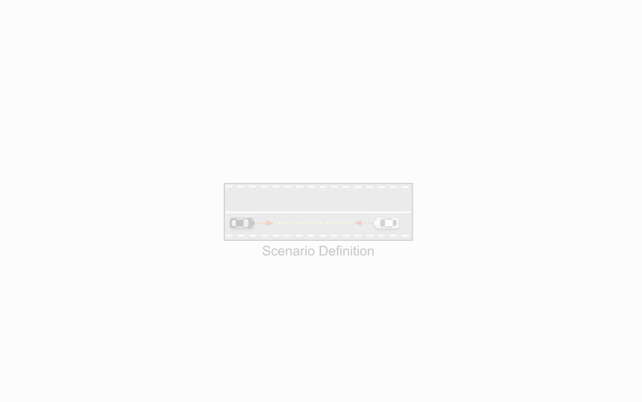
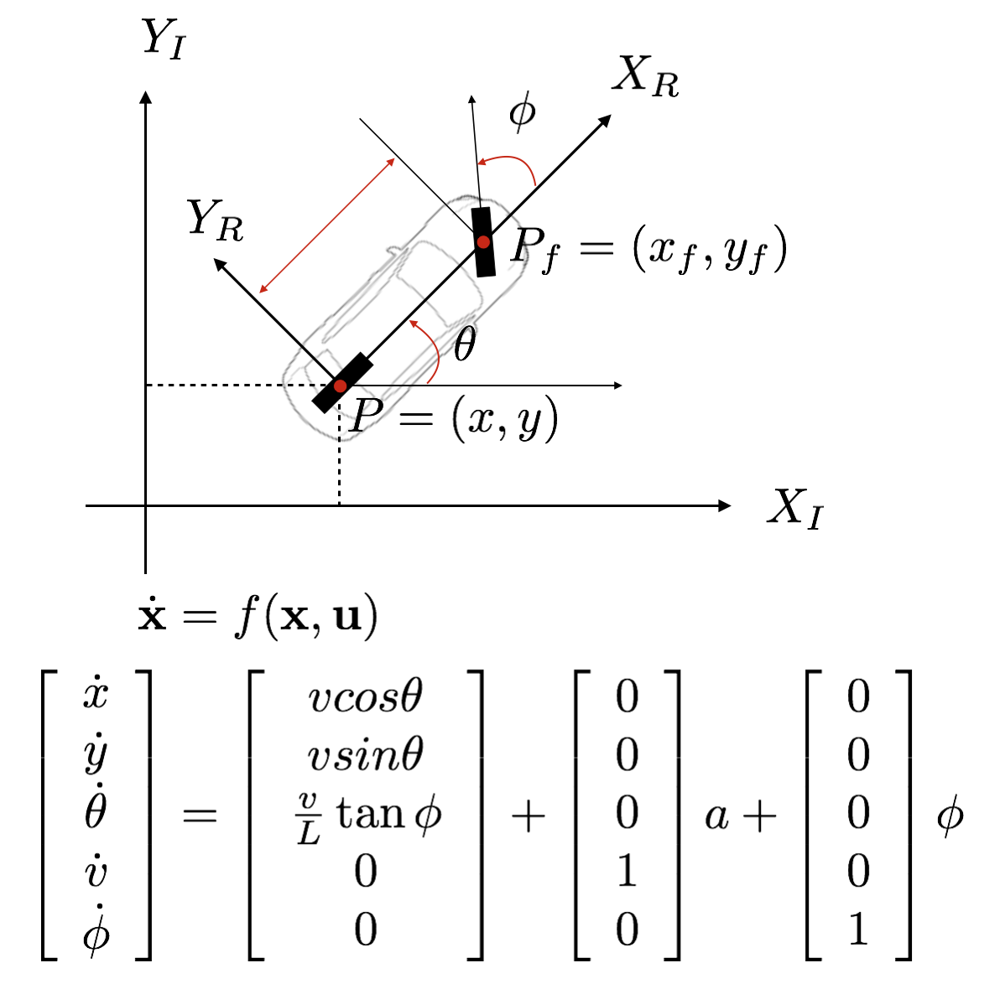

# NeuroNCAP Framework
To make our framework easy to run with any model (and their individual dependencies), we have designed our framework as node in a network. This node will make API calls to other nodes in the network (i.e., your model node, and the rendering node) to run the evaluation. This way, you can create your model with any dependencies, regardless of the dependencies of the NeuroNCAP code and the rendering framework. This also means that you can swap out the rendering engine with your own, as long as it implements the same API as the rendering node. This use-case should not be very common, but it is possible.

The framework is illustrated in the figure below. In the figure, the NeuroNCAP node is responsible for the *Controller* and the *Vehicle Model* while the *Neural Renderer* and *AD Model* is taken care of by the model node and the rendering node respectively.




### NeuroNCAP Node
The NeuroNCAP code is a lightweight node acting as the orchestrator between the model and rendering api. It is also responsible for propagating the ego-vehicle state forward in time, as well as collision checking, evaluation accumulation, and scoring. This code is found in this repository.

### Model Node
This is the node that you will create to run your model. This is not as hard as it may sound. You simply need to implement a [FastAPI](https://fastapi.tiangolo.com/) server that share some common endpoints with the NeuroNCAP node. The endpoints are:

We have provided examples on how to implement the server for both [UniAD]() and [VAD]() , which you can use as a starting point. Note that you can use any framework you like, as long as you implement the following endpoints:

```python
@app.get("/alive")
async def alive() -> bool:
    """Check if the server is alive."""

@app.post("/infer")
async def infer(data: InferenceInputs) -> InferenceOutputs:
    """Run inference on the given data.

    This code usually involves formatting the inputs to the model,
    running the model and then returning the results."""

@app.post("/reset")
async def reset_runner() -> bool:
    """Reset the runner."""
```


### Rendering Node
We are using [NeuRAD](https://github.com/georghess/neurad) as the rendering engine for the framework. Thus, we have created a docker container that holds the rendering engine code and spawns a server that listens for requests from the NeuroNCAP node. We've also written a downloading script for downloading the corresponding NeuRAD network weights [here]().

If you wish to change the rendering engine, you have to implement an API that listens for the same requests as the NeuRAD server, namely
```python
@app.get("/alive")
async def alive() -> bool:
    """Check if the server is alive."""

@app.get("/get_actors")
async def get_actors() -> list[ActorTrajectory]:
    """Get actor trajectories."""


@app.post("/update_actors")
async def update_actors(actor_trajectories: list[ActorTrajectory]) -> None:
    """Update actor trajectories (keys correspond to actor uuids)."""


@app.post("/render_image", response_class=Response, responses={200: {"content": {"image/png": {}}}})
async def render_image(data: RenderInput) -> Response:
    """Render an image."""

@app.get("/start_time")
async def get_start_time() -> int:
    """Get the start time of the scenario."""
```

For more inspiration on how to implement the rendering engine server, please refer to the [NeuRAD code](https://github.com/georghess/neurad-studio/tree/main/nerfstudio/scripts/closed_loop).


### Additional information
To propagate the state forward in time, we make use of a KinematicBicycleModel, defined as


We use an Linear Quadratic Regulator (LQR) to calculate the control inputs for the ego vehicle, and we impose a maximum acceleration and steering angle on the ego vehicle. All of these modules are implemented in the [NuPlan development kit](https://github.com/motional/nuplan-devkit).
